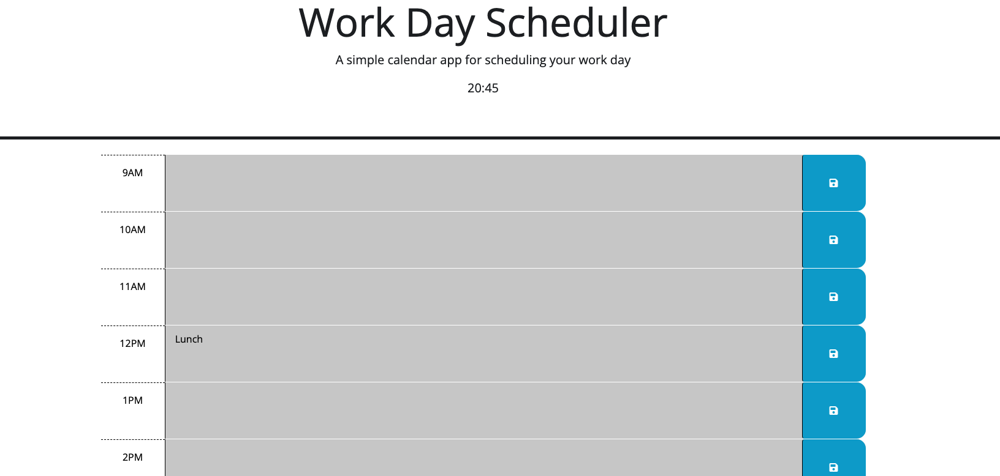

# Work-day-scheduler

## Description

This project is an example of a day to day planner based off of common 9-5 business hours, tailored more towards a work day functionality. My objective with this project was to create a way that a user could log their day to day tasks and responsibilities and utilize local storage so everything is saved and displayed offering a way to keep track of users tasks in an easy to use, visually appealing way, eliminating the need to write them down on paper and with the utilization of local storage, inputs will be saved. So in the event of the application being closed out of, users' information will still be saved in the input boxes. Building this project really allowed me to focus on use of Jquery, as well as utilization of web API's to tie in relative real time data to the page.

## Installation

This application is available to use via your browser and requires no further installation.

## Usage

When the user loads the application, the current time of day is presented at the top, and if the web page is shown. The user is presented with a 9-5 worday layout broken up into hourly sections. The user can then input any tasks/responsibilities/reminders for any given hour, and results will be saved within that hour block. 

 

## License

MIT License info can be found in the LICENSE file attatched to this webpage.

